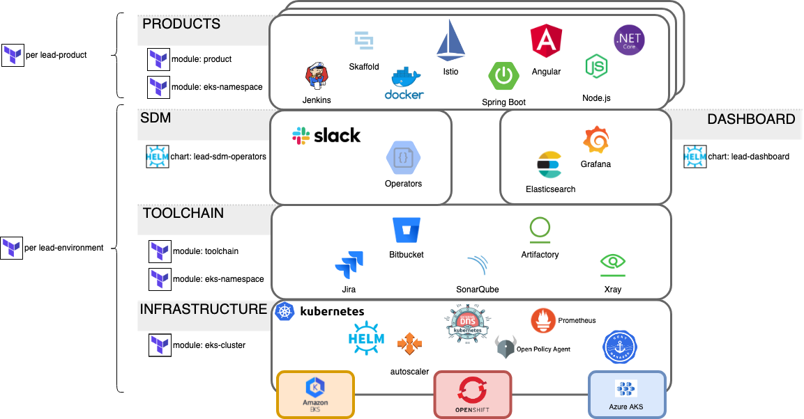

# Overview
This repository contains the Terraform automation to manage LEAD environments.



# Environments
Each environment is managed by a subdirectory for that environment under `environments/`.  The environment can be converged by running the following with an AWS_PROFILE set for an account that can assume role to the `iam_role` defined for the environment.

```
cd environments/<my-environment-name>
terragrunt apply
```

# Secrets
You'll need to create a `secrets/` directory with a file for each environment (e.g. liatrio-sandbox.tfvars) containing the secrets for that account.

# Prerequisite
Install required tools with [Homebrew](https://brew.sh/):

```
brew bundle
```